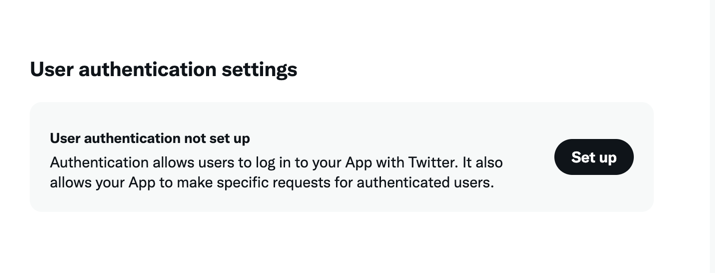
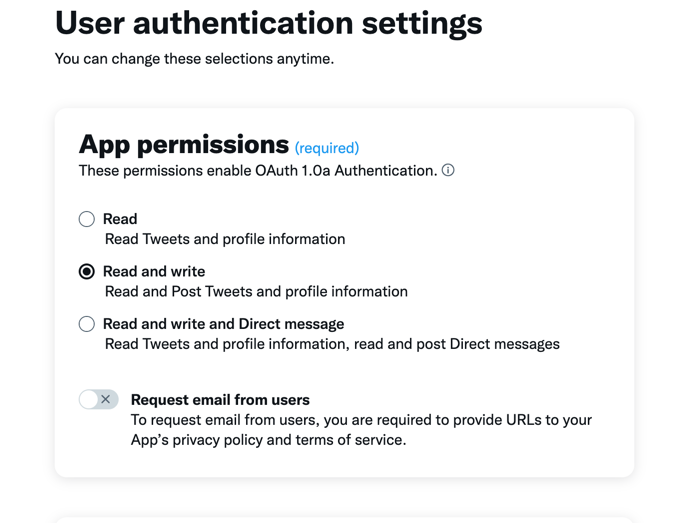
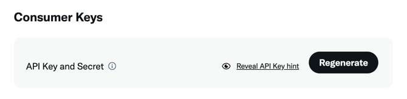
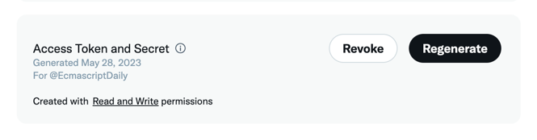

# RSS To Twitter

[](https://github.com/azu/rss-to-twitter/actions)
[](https://github.com/azu/rss-to-twitter/blob/master/LICENSE)

GitHub Actions post twitter from RSS Feeds.

## Post Steps

1. Fetch RSS Feeds
2. Filter feed items by publish time
3. Post to twitter.

If your action uses `on.schedule.cron`, filter feed items by publish time compare to previous cron execution time.
If your action uses other events like `on.push`, you need to set `UPDATE_WITHIN_MINUTES` option.

## Usage

### Prepare Twitter API Keys

1. Create Twitter App - <https://developer.twitter.com/en/portal/dashboard>
2. Change your app permission to `Read and Write`
  - 
  - 
3. Get API Key/API Key Secret and Access Token/Access Token Secret
   - 
   - `TWITTER_APIKEY` and `TWITTER_APIKEY_SECRET`
   - 
   - `TWITTER_ACCESS_TOKEN` and `TWITTER_ACCESS_TOKEN_SECRET`
   - :warning: Check "Created with **Read and Write** permissions" on your app page.
4. Add these keys to GitHub Secrets
   - `TWITTER_APIKEY`
   - `TWITTER_APIKEY_SECRET`
   - `TWITTER_ACCESS_TOKEN`
   - `TWITTER_ACCESS_TOKEN_SECRET`

:memo: Bearer Token is not needed.

### On schedule

Post new feed item via schedule cron every 15 minutes.

```yaml
name: rss-to-twitter
on:
  schedule:
    # every 15 minutes
    - cron: "*/15 * * * *"
  workflow_dispatch:
jobs:
  twitter:
    runs-on: ubuntu-latest
    steps:
      - uses: azu/rss-to-twitter@v1
        with:
          # RSS feed URL
          RSS_URL: "https://hnrss.org/newest"
          TWEET_TEMPLATE: 'New Post: "%title%" %url%'
          TWITTER_APIKEY: ${{ secrets.TWITTER_APIKEY }}
          TWITTER_APIKEY_SECRET: ${{ secrets.TWITTER_APIKEY_SECRET }}
          TWITTER_ACCESS_TOKEN: ${{ secrets.TWITTER_ACCESS_TOKEN }}
          TWITTER_ACCESS_TOKEN_SECRET: ${{ secrets.TWITTER_ACCESS_TOKEN_SECRET }}
```

> **Note**: filter feed items by publish time compare to previous cron execution time.


### On Page build

Post new feed item via GitHub Pages Build event.

```yaml
name: rss-to-twitter
on:
  page_build
jobs:
  twitter:
    # if github.event.build.error.message is not null, it means that the build failed. Skip it
    if: ${{ github.event.build.error.message == null }}
    runs-on: ubuntu-latest
    steps:
      - uses: azu/rss-to-twitter@v1
        with:
          RSS_URL: "https://you.github.io/feed.xml"
          TWEET_TEMPLATE: 'New Post: "%title%" %url%'
          UPDATE_WITHIN_MINUTES: 15 # post items that are published within 15 minutes
          TWITTER_APIKEY: ${{ secrets.TWITTER_APIKEY }}
          TWITTER_APIKEY_SECRET: ${{ secrets.TWITTER_APIKEY_SECRET }}
          TWITTER_ACCESS_TOKEN: ${{ secrets.TWITTER_ACCESS_TOKEN }}
          TWITTER_ACCESS_TOKEN_SECRET: ${{ secrets.TWITTER_ACCESS_TOKEN_SECRET }}
```

- Example:
  - Workflow: https://github.com/ecmascript-daily/ecmascript-daily.github.com/blob/master/.github/workflows/rss-to-twitter.yml
  - Twitter: https://twitter.com/EcmascriptDaily/

> **Note**: filter feed items by publish time within 15 minutes.

> **Warning**: If you deploy your site by GitHub Actions, you need to use Personal Access Token instead of `${{ secrets. GITHUB_TOKEN }}`. `${{ secrets. GITHUB_TOKEN }}` can not trigger `page_build` event. It is limitation of GitHub Actions's `${{ secrets. GITHUB_TOKEN }}`.

- [Automatic token authentication - GitHub Docs](https://docs.github.com/en/enterprise-server@2.22/actions/security-guides/automatic-token-authentication#using-the-github_token-in-a-workflow)
- [github actions - Push event doesn't trigger workflow on push paths - Stack Overflow](https://stackoverflow.com/questions/67550727/push-event-doesnt-trigger-workflow-on-push-paths)

Instead of It, you can use Personal Access Token for deploy, and it triggers `page_build` event.

- Example:
  - Deploy Workflow: https://github.com/jser/jser.github.io/blob/a0fcfc6ef3829055ee10807009d04fb6431a4daf/.github/workflows/deploy.yml#L26-L35
  - RSS to Twitter Workflow:https://github.com/jser/jser.github.io/blob/a0fcfc6ef3829055ee10807009d04fb6431a4daf/.github/workflows/rss-to-twitter.yml
  - Twitter:https://twitter.com/jser_info

## Release Flow

1. Tag to `v*` on Release Pages
2. CI build action and push it

## License

MIT

----

## Table of Contents

<!-- START doctoc generated TOC please keep comment here to allow auto update -->
<!-- DON'T EDIT THIS SECTION, INSTEAD RE-RUN doctoc TO UPDATE -->
<details>
<summary>Details</summary>

- [Setup](#setup)
  - [yarn](#yarn)
  - [npm](#npm)
- [Workflows](#workflows)
  - [ci.yml](#ciyml)
  - [add-version-tag.yml](#add-version-tagyml)
  - [toc.yml](#tocyml)
  - [issue-opened.yml](#issue-openedyml)
  - [pr-opened.yml](#pr-openedyml)
  - [pr-updated.yml](#pr-updatedyml)
  - [project-card-moved.yml](#project-card-movedyml)
  - [broken-link-check.yml](#broken-link-checkyml)
  - [update-dependencies.yml](#update-dependenciesyml)
  - [add-test-tag.yml](#add-test-tagyml)
  - [Secrets](#secrets)
- [Test release](#test-release)
- [Helpers](#helpers)
- [Author](#author)

</details>
<!-- END doctoc generated TOC please keep comment here to allow auto update -->

## Setup
### yarn
- `yarn setup`
### npm
- `npm run setup`

## Workflows

Some `workflows` are included by default.  

### ci.yml
CI Workflow

1. ESLint
1. Jest
   - Send coverage report to codecov if `CODECOV_TOKEN` is set.
1. Release GitHub Actions
   - if tag is added.
1. Publish package
   - if tag is added and `NPM_AUTH_TOKEN` is set.
1. Publish release
   - if 3 and 4 jobs are succeeded.
1. Notify by slack
   - if workflow is failure

[ACCESS_TOKEN](#access_token) is required.  
[SLACK_WEBHOOK_URL](#slack_webhook_url) is required.  

### add-version-tag.yml
Add the release tag when pull request is merged.

1. Get next version from commits histories.  
   see [Conventional Commits](https://www.conventionalcommits.org/en/v1.0.0/)
1. Add tag.
1. Create branch for next version.

[ACCESS_TOKEN](#access_token) is required.

### toc.yml
Create TOC (Table of contents)

[ACCESS_TOKEN](#access_token) is required.

### issue-opened.yml
- Assign the issue to project  
   default setting:  
   ```
   Project: Backlog
   Column: To do
   ```
- Assign author to issue

### pr-opened.yml
- Assign the PR to project  
   default setting:  
   ```
   Project: Backlog
   Column: In progress
   ```
   [ACCESS_TOKEN](#access_token) is required.
- Assign author to PR
- Add labels by branch  
   [setting](.github/pr-labeler.yml)

### pr-updated.yml
- Add labels by changed files
   [setting](.github/labeler.yml)
- Create PR histories
- Manage PR by release type  
   [ACCESS_TOKEN](#access_token) is required.
- Check version in package.json  
   [ACCESS_TOKEN](#access_token) is required.
- Check if it can be published to npm  
   if `NPM_AUTH_TOKEN` is set

### project-card-moved.yml
Manage labels by moving project cards

### broken-link-check.yml
Check broken link in README

### update-dependencies.yml
Update package dependencies

- schedule
- PR opened, closed
- repository dispatch

### add-test-tag.yml
Add tag for test release

### Secrets
#### ACCESS_TOKEN
[Personal access token](https://help.github.com/en/github/authenticating-to-github/creating-a-personal-access-token-for-the-command-line) with the public_repo or repo scope  
(repo is required for private repositories)

#### SLACK_WEBHOOK_URL
https://api.slack.com/messaging/webhooks

## Test release
[](https://github.com/azu/release-github-actions-cli)

1. Create `.env`  
   Set [Personal access token](https://help.github.com/en/github/authenticating-to-github/creating-a-personal-access-token-for-the-command-line)
   ```dotenv
   token=1234567890abcdef1234567890abcdef12345678
   ```
1. Run `yarn release`
   - Dry run: `yarn release -n`
   - Help: `yarn release -h`


Then, you can use your `GitHub Actions` like follows:

```yaml
on: push
name: Test
jobs:
  toc:
    name: Test
    runs-on: ubuntu-latest
    steps:
      - uses: owner/repo@gh-actions
```
